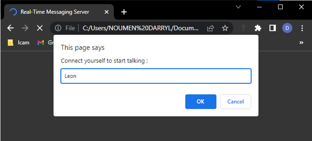

# real-time-server
Build a real-time messaging server between multiple clients using NodeJS and ws library

## Summary
1. About
2. Presentation & Examples

## 1. About
### 1.1 Installation
This api uses NodeJS version 16.14.2 and some other dependencies the versions of which are :
```dependencies
express :  "^4.18.2",
http : "^0.0.1-security",
nodemon : "^2.0.16",
ws : "^8.11.0"
```
#### 1.1.1 Install the project dependencies
First, open the project on Visual Studio Code. Once it did, then go to terminal and type :
```dependencies
npm install
```

#### 1.1.2 Launch the server
To launch the server, just go back to your Visual Studio Code then on terminal and type the following command :
```nodejs
npm start
```

#### 1.1.3 Open index.html in a browser
In order to test the functioning of this project, open the index.html file in a browser or use the live server feature or extension available in VS Code.

### 1.2 Contribution
In order to enhance to this project, just make a contribution by doing a pull request. It'll be a great pleasure to receive it.
### 1.3 Author
[NOUMEN Darryl](https://www.linkedin.com/in/darryl-noumen-941213255/)

## 2 Presentation & Examples
### 2.1 Structure
After following the instructions above, the project structure may look like this :


### 2.2 Example
> Connect yourself by entering your name


> Connect the other client by entering someone else name


> Start texting or messaging with the other client

